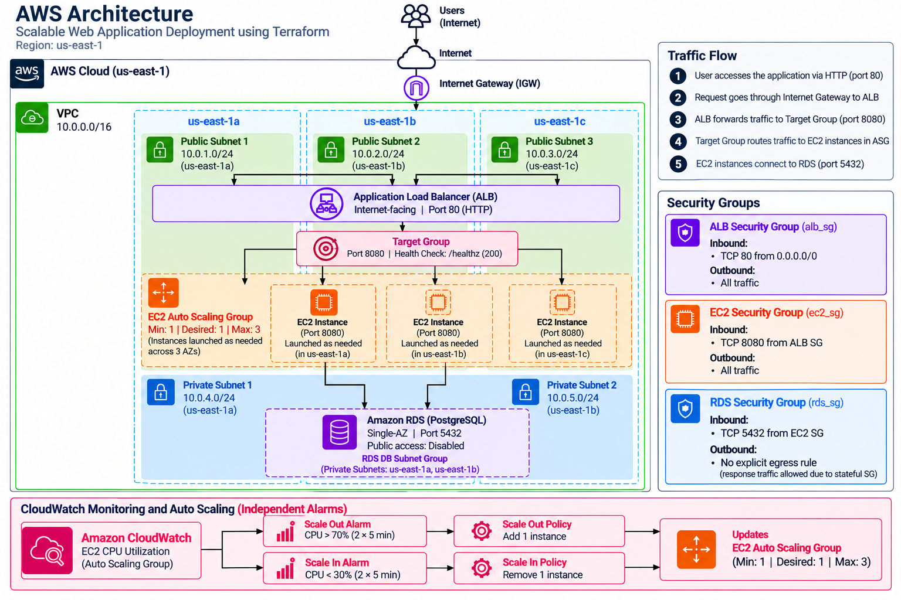

# Scalable Web Application Infrastructure on AWS with Terraform

Infrastructure-as-Code project for deploying a scalable web application architecture on AWS using Terraform.

The project provisions a custom VPC, internet-facing Application Load Balancer, EC2 Auto Scaling Group, PostgreSQL RDS database, security groups, route tables, and CloudWatch alarms.

## Architecture Overview

The application is deployed inside a custom AWS VPC in the `us-east-1` region.

The infrastructure includes:

- 1 custom VPC
- 3 public subnets across `us-east-1a`, `us-east-1b`, and `us-east-1c`
- 2 private subnets across `us-east-1a` and `us-east-1b`
- Internet Gateway
- Public and private route tables
- Internet-facing Application Load Balancer
- ALB Target Group
- EC2 Launch Template
- EC2 Auto Scaling Group
- PostgreSQL Amazon RDS instance
- Separate security groups for ALB, EC2, and RDS
- CloudWatch CPU utilization alarms
- Terraform-managed infrastructure

## Architecture Diagram



### Request Flow

```text
User
  |
  | HTTP :80
  v
Internet Gateway
  |
  v
Application Load Balancer
  |
  | HTTP :8080
  v
ALB Target Group
  |
  v
EC2 Auto Scaling Group
  |
  | PostgreSQL :5432
  v
Amazon RDS PostgreSQL
```

The Application Load Balancer distributes incoming requests across EC2 instances registered with its target group.

The EC2 application instances communicate with the PostgreSQL database through the RDS security group.

## Network Architecture

The VPC uses the CIDR range:

```text
10.0.0.0/16
```

### Public Subnets

| Subnet | Availability Zone | CIDR |
| --- | --- | --- |
| Public Subnet 1 | us-east-1a | 10.0.1.0/24 |
| Public Subnet 2 | us-east-1b | 10.0.2.0/24 |
| Public Subnet 3 | us-east-1c | 10.0.3.0/24 |

The public subnets are associated with a route table containing:

```text
0.0.0.0/0 -> Internet Gateway
```

The Application Load Balancer and EC2 Auto Scaling Group use these public subnets.

### Private Subnets

| Subnet | Availability Zone | CIDR |
| --- | --- | --- |
| Private Subnet 1 | us-east-1a | 10.0.4.0/24 |
| Private Subnet 2 | us-east-1b | 10.0.5.0/24 |

The private subnets are used by the RDS DB subnet group.

The RDS instance is configured with:

```text
publicly_accessible = false
```

This prevents direct public access to the database.

## Application Load Balancer

The project provisions an internet-facing AWS Application Load Balancer across all three public subnets.

The ALB accepts:

```text
HTTP :80
```

and forwards requests to the application target group on:

```text
HTTP :8080
```

The target group performs application health checks using:

```text
/healthz
```

A target is considered healthy when the endpoint returns HTTP status `200`.

## Auto Scaling

EC2 instances are managed by an Auto Scaling Group using an AWS Launch Template.

Current configuration:

```text
Minimum capacity: 1
Desired capacity: 1
Maximum capacity: 3
```

The Auto Scaling Group spans the three public subnets.

This allows AWS to launch additional application instances when the configured scaling conditions are met.

## CloudWatch Monitoring and Scaling

CloudWatch monitors EC2 CPU utilization for the Auto Scaling Group.

### Scale Out

When average CPU utilization exceeds:

```text
70%
```

for two consecutive five-minute evaluation periods, the scale-out policy adds one instance.

### Scale In

When average CPU utilization falls below:

```text
30%
```

for two consecutive five-minute evaluation periods, the scale-in policy removes one instance.

Each scaling action has a cooldown period of 300 seconds.

## Database

The application uses Amazon RDS for PostgreSQL.

Current database configuration includes:

```text
Engine: PostgreSQL
Version: 16
Port: 5432
Allocated Storage: 20 GB
Public Access: Disabled
```

The database uses an RDS DB subnet group containing the two private subnets.

The current Terraform configuration does not enable RDS Multi-AZ deployment.

## Security Groups

The infrastructure uses separate security groups to restrict communication between architecture layers.

### ALB Security Group

Inbound:

```text
TCP 80
Source: 0.0.0.0/0
```

This allows users on the internet to reach the Application Load Balancer.

### EC2 Security Group

Inbound:

```text
TCP 8080
Source: ALB Security Group
```

Application traffic on port 8080 is allowed from the ALB security group.

### RDS Security Group

Inbound:

```text
TCP 5432
Source: EC2 Security Group
```

Only EC2 instances associated with the application security group can initiate PostgreSQL connections to the RDS database.

This creates the following security-group chain:

```text
Internet
   |
   | TCP 80
   v
ALB Security Group
   |
   | TCP 8080
   v
EC2 Security Group
   |
   | TCP 5432
   v
RDS Security Group
```

## Infrastructure as Code

All AWS infrastructure is provisioned through Terraform.

The configuration is separated into multiple files based on responsibility:

```text
Terraform/
├── main.tf
├── alb.tf
├── autoscaling.tf
├── launchtemplate.tf
├── rds.tf
├── securitygroups.tf
├── variables.tf
├── outputs.tf
├── terraform.tfvars.example
└── .gitignore
```

### File Responsibilities

`main.tf`

Creates:

- AWS provider configuration
- VPC
- Public subnets
- Private subnets
- Internet Gateway
- Route tables
- Route table associations

`alb.tf`

Creates:

- Application Load Balancer
- Target Group
- HTTP Listener
- Health Check

`launchtemplate.tf`

Creates:

- EC2 Launch Template
- EC2 instance configuration
- Application environment configuration

`autoscaling.tf`

Creates:

- Auto Scaling Group
- Scale-out policy
- Scale-in policy
- CloudWatch CPU alarms

`rds.tf`

Creates:

- PostgreSQL RDS instance
- RDS DB subnet group
- RDS parameter group

`securitygroups.tf`

Creates:

- ALB Security Group
- EC2 Security Group
- RDS Security Group

`variables.tf`

Defines configurable infrastructure values.

`outputs.tf`

Returns useful deployment information including:

- VPC ID
- Public subnet IDs
- Private subnet IDs
- ALB DNS name
- RDS endpoint

## Deployment

### Prerequisites

Before deploying the infrastructure, install:

- Terraform
- AWS CLI
- An AWS account with appropriate IAM permissions

Configure AWS credentials:

```bash
aws configure
```

Clone the repository:

```bash
git clone https://github.com/yasshh17/Scalable-Web-Application-Deployment-using-AWS-and-Terraform-.git
cd Scalable-Web-Application-Deployment-using-AWS-and-Terraform-/Terraform
```

Create a Terraform variables file based on the provided example:

```bash
cp terraform.tfvars.example terraform.tfvars
```

Provide the required values, including the database password.

Initialize Terraform:

```bash
terraform init
```

Format the configuration:

```bash
terraform fmt
```

Validate the configuration:

```bash
terraform validate
```

Review the infrastructure Terraform will create:

```bash
terraform plan
```

Deploy the infrastructure:

```bash
terraform apply
```

After deployment, Terraform outputs the ALB DNS name and RDS endpoint.

## Destroying the Infrastructure

To remove the AWS resources created by the project:

```bash
terraform destroy
```

Always review the destroy plan before confirming the operation.

## Key Concepts Demonstrated

This project demonstrates practical experience with:

- Infrastructure as Code
- Terraform
- AWS networking
- VPC design
- Public and private subnets
- Subnets distributed across multiple Availability Zones
- Route tables
- Internet Gateway
- Application Load Balancing
- EC2 Launch Templates
- Auto Scaling Groups
- Target Groups
- Application health checks
- CloudWatch monitoring
- CPU-based scaling
- Amazon RDS
- PostgreSQL
- Security Groups
- Network access isolation

## Current Design Considerations

This project is intended as an infrastructure and cloud architecture demonstration.

The current implementation could be extended for a more production-oriented deployment by:

- Adding HTTPS using AWS Certificate Manager
- Redirecting HTTP traffic to HTTPS
- Moving application EC2 instances into private subnets
- Adding NAT Gateway access where required
- Maintaining at least two application instances for baseline availability
- Enabling RDS Multi-AZ deployment
- Storing database credentials in AWS Secrets Manager or Systems Manager Parameter Store
- Adding encrypted RDS storage configuration
- Adding automated database backups and retention policies
- Adding AWS WAF in front of the Application Load Balancer
- Adding Route 53 and a custom domain
- Adding centralized application logging
- Adding CI/CD for Terraform validation and deployment
- Using remote Terraform state with S3 and state locking where appropriate

## Technology Stack

**Cloud**

- AWS VPC
- Amazon EC2
- Application Load Balancer
- EC2 Auto Scaling
- Amazon RDS
- Amazon CloudWatch

**Infrastructure as Code**

- Terraform

**Database**

- PostgreSQL

## Project Goal

The goal of this project is to demonstrate how Terraform can be used to provision and manage a multi-tier AWS architecture with controlled network access, load balancing, automatic scaling, database isolation, and infrastructure monitoring.
